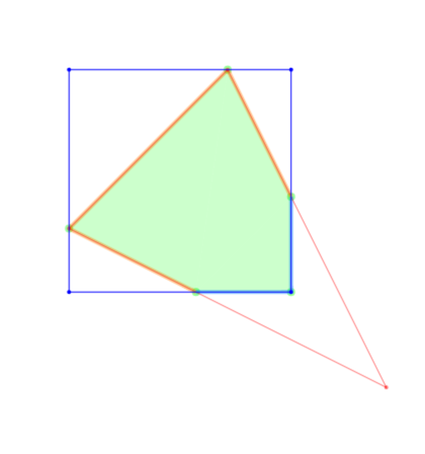

linetrim-pslg
============

This module trims the edges in a planar straight line graph (pslg) based on another planar straight line graph.

This code is a modified version of Mikola Lysenko's
[overlay-pslg](https://github.com/mikolalysenko/overlay-pslg) code. It is
correct to the best of my knowledge, but I suspect there are simpler correct
algorithms in the literature.

# Example

Here is a simple example showing how to use this module to compute the intersection of two PSLGs:

```javascript
//Load the module
var linetrim = require('linetrim-pslg')

//Red PSLG - Define a triangle
var linePoints = [
  [0.5, 0.25],
  [0.25, 0.5],
  [0.75, 0.75]
]
var lineEdges = [ [0,1], [1,2], [2,0] ]

//Blue PSLG - Define a square
var polyPoints = [
  [0.25, 0.25],
  [0.25,  0.6],
  [0.6, 0.6],
  [0.6, 0.25]
]
var polyEdges = [ [0,1], [1,2], [2,3], [3,0] ]

//Construct intersection
console.log(linetrim(linePoints, lineEdges, polyPoints, polyEdges, false))
```

#### Output

The result of this module is the following JSON:

```javascript
{ points: 
   [ [ 0.75, 0.75 ],
     [ 0.44999999999999996, 0.6 ],
     [ 0.6, 0.44999999999999996 ] ],
  edges: [ [ 0, 1 ], [ 0, 2 ] ] }
```

We can visualize this result as follows:



# Install

To install this module, you can use [npm](http://docs.npmjs.com).  The command is as follows:

```
npm i linetrim-pslg
```

It works in any reasonable CommonJS environment like [node.js](http://nodejs.org). If you want to use it in a browser, you should use [browserify](http://browserify.org).

# API

#### `require('linetrim-pslg')(linePoints, lineEdges, bluePoints, blueEdges[, intersectMode])`
Computes a Boolean operation between two planar straight line graphs.

* `linePoints, lineEdges` are the points and edges of the lines that will be cut up
* `bluePoints, blueEdges` are the points and edges of the polygons
* `intersectMode` specifies if we're in intersect mode (`true`) or subtract mode (`false`)

**Returns** An object encoding a planar straight line graph with the remaining line segments

* `points` are the points of the result
* `edges` are the edges we have kept, indexing into the `points` array.

**Note** The interiors of the polygon are computed using `cdt2d`. It counts the parity of the path with the fewest number of boundary crossings for each point.  Even parity points are in the exterior, odd parity in the interior.

# License
(c) 2017 Joseph Gentle, Mikola Lysenko. MIT License
